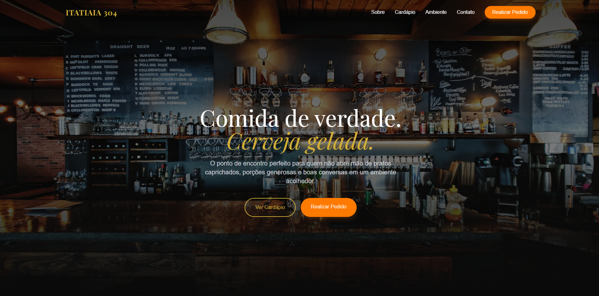

# 🍻 Itatiaia 304 | Landing Page Premium para Bar e Gastronomia

Uma Single Page Application (SPA) moderna, responsiva e de alta performance desenvolvida para o bar Itatiaia 304, focado em gastronomia tradicional na região da Lagoinha. O projeto une um design sofisticado a uma excelente Experiência do Usuário (UX), otimizando a captação de clientes para Delivery e Retirada via WhatsApp.

🔗 **[Acessar o site em produção](https://site-itatiaia-304-bar-restaurante-j.vercel.app/)**

---

## 💻 Tecnologias Utilizadas

Este projeto foi construído com as tecnologias mais modernas do ecossistema front-end:

* **[React](https://reactjs.org/)** + **[Vite](https://vitejs.dev/)**: Para uma arquitetura de componentes escalável e um ambiente de desenvolvimento ultrarrápido.
* **[Tailwind CSS](https://tailwindcss.com/)**: Estilização utilitária avançada, garantindo um design system consistente (com cores personalizadas da marca) e responsividade fluida.
* **[Framer Motion](https://www.framer.com/motion/)**: Criação de animações cinematográficas, transições de scroll suaves e interações de micro-UX (como hover em cards e imagens).
* **[Lucide React](https://lucide.dev/)**: Biblioteca de ícones leves e customizáveis.

---

## ✨ Destaques Técnicos e Decisões de UX

Mais do que uma página estática, este projeto foi pensado para resolver problemas de negócio através de engenharia front-end:

* **Responsividade Adaptativa (Grid vs. Carrossel):** Implementação de um sistema inteligente na seção de Avaliações. No Desktop, os cards usam uma expansão em Grid controlada por estado (`useState`) com animação de scroll matematicamente calculada (`animate`). No Mobile, a seção se transforma automaticamente em um Carrossel Nativo (CSS Scroll Snap), economizando recursos ao não utilizar bibliotecas de terceiros pesadas.
* **Gerenciamento de Estado para Regras de Negócio:** Uso de `useState` para controlar a barra de avisos dinâmicos (Top Banner promocional), permitindo atualizações de marketing em tempo real sem poluir a navegação.
* **Sticky Header com Efeito Glassmorphism:** O menu de navegação transiciona dinamicamente de transparente para um fundo escuro com desfoque (backdrop-blur) conforme o usuário rola a tela, mantendo o branding sempre visível sem prejudicar a leitura do conteúdo.
* **Performance e SEO:** Estrutura semântica do HTML5, imagens otimizadas e carregamento rápido proporcionado pelo *build* do Vite.

---

## 🚀 Como rodar o projeto localmente

1. Clone o repositório:
    git clone https://github.com/BernardoPiresMascarenhas/Site-Itatiaia-304-Bar---Restaurante.git

2. Acesse a pasta do projeto:
    cd itatiaia-304

3. Instale as dependências:
    npm install

4. Inicie o servidor de desenvolvimento:
    npm run dev

---

## 👨‍💻 Autor

**Bernardo Pires**
*Desenvolvedor Front-end em formação, focado em criar interfaces de alto impacto visual e performance.*

* [LinkedIn](www.linkedin.com/in/bernardo-pires-)
* [GitHub](https://github.com/BernardoPiresMascarenhas)
* [Portfólio](https://github.com/BernardoPiresMascarenhas/Site-Itatiaia-304-Bar---Restaurante)